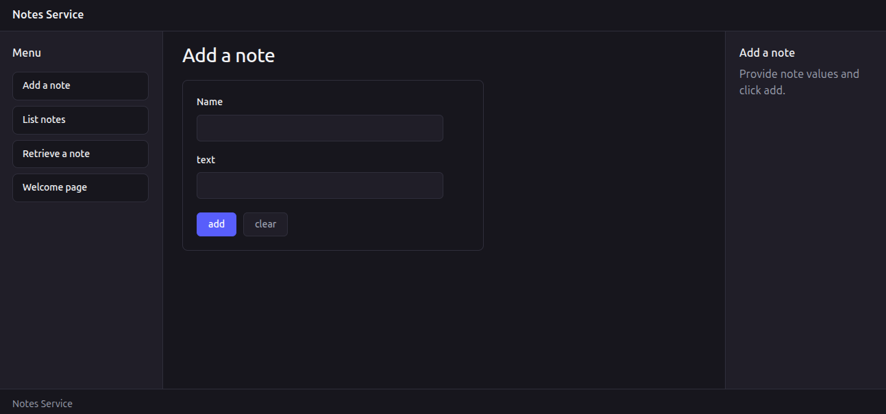

# AI assisted prototyped UI for Notes Service

> 🛑 **Notice:** Not to be copied. Not to be cloned. Not to be run. This is not production ready. 
> This setup is strictly a proof-of-concept demonstration and does not constitute technical guidance. No claims or guarantees are made regarding code quality, stability, or agent management. Anyone who attempts to replicate or run this code does so entirely at their own risk and assumes full responsibility for any resulting costs, API usage, or system behaviors.

This is an AI-assisted prototype of a React App that will use the Notes Service. Only for portfolio showcasing. This is work in progress.

Please check AGENTS.md and git commit history to check the taken workflow.

